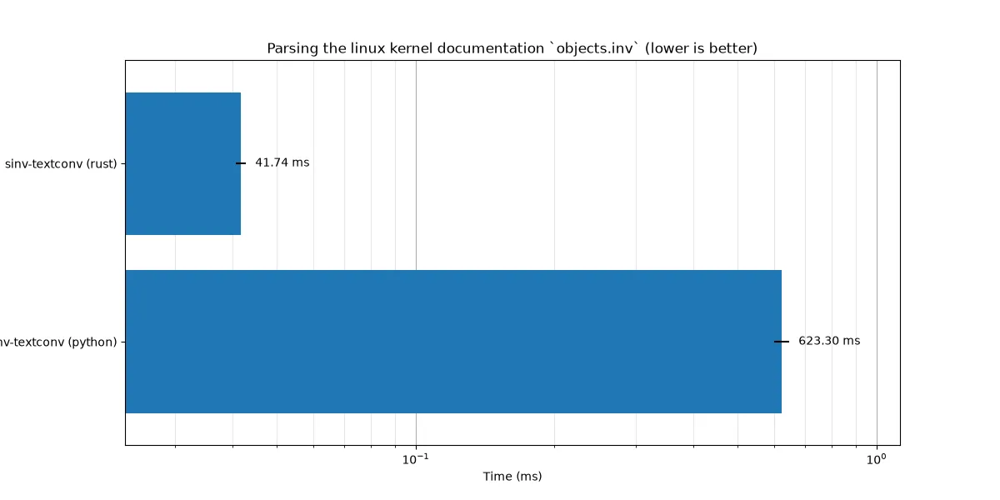

# sinv-textconv

[](https://opensource.org/licenses/MIT)
[](https://codecov.io/gh/aslowwriter/sinv-textconv)
[](https://crates.io/crates/sinv-textconv)


A fast git textconv driver for Sphinx inventory files (`objects.inv`)

`sinv-textconv` is a cli program for use as a `git textconv` option to view diffs between Sphinx inventory files (typically called `objects.inv`). `textconv` is a git configuration option to instruct git to use a certain program to convert binary files to plain text so that a diff can be displayed. 

If you keep `objects.inv` in your history, (or want to diff them yourself) this program offers a fast and convenient way to do that. 

This project is directly modeled after [sphobjinv-textconv](https://sphobjinv.readthedocs.io/en/stable/cli/textconv.html), but we are around 15x times faster on a benchmark of the linux kernel docs inventory file. (see [the benchmark section](#benchmarks))

## Table of Contents

- [Features](#features)
- [Installation](#installation)
- [Usage](#usage)
- [Benchmarks](#benchmarks)
- [FAQ](#FAQ)
- [Acknowledgements](#Acknowledgements)

## Features

`sinv-textconv` is kept intentionally minimal in functionality so it is as light weight as possible and is optimized for its intended use case instead for cli convenience.

Specifically this means that: 
1. It takes _exactly_ one argument, that being the path to an inventory file, and it will output the contents of that file in plaintext over stdout
2. The contents of the file are NOT parsed, and instead the entire zlib content is dumped directly into stdout. This is because it's not uncommon for Sphinx to produce references that don't conform to the format and thus can't be parsed (like happens in the linux kernel docs). You might still want to see the diff for these, hence the decision to not parse the contents.

If you are looking for an application that is more optimized for direct user interaction and does parse the contents please see [sinv](https://github.com/aslowwriter/sinv). I've decided to publish these as separate programs mostly to keep the cli of `sinv` better suited for direct user interaction, and the git `textconv` cli comes with somewhat strict requirements. 


## Installation

Currently the only way to install it is through cargo:

```bash
cargo install sinv-textconv
```

## Usage

After you installed the program, you can have git use it automatically as a "diff driver" by adding the following lines to a `.gitconfig` (can be either user, system, or repo-specific):

```
 [diff "objects_inv"]
        textconv = sinv-textconv
```

After that you'll need to associate a file glob with that driver, by adding these lines to `.gitattributes` (again can be system, user or repo-specific):

```
*.inv diff=objects_inv
```

Then any diff you show through other means should be able to show you a nice plaintext diffs of the files. 

If you want to simply inspect the file you can do that by piping it into your favourite pager, like normal: 

```bash
sinv-textconv foo.inv | less
```

In case you want to do one-off diffs of files that aren't in a repository you can use process substitution: 

```bash
diff <(sinv-textconv foo.inv) <(sinv-texconv bar.inv)
```

Note once again that this conversion is only one way and does not parse the contents to check them for correctness. If you want a tool that does those things please see [sinv](https://github.com/aslowwriter/sinv)

## Benchmarks

Comparing to [sphobjinv-textconv] when operating on the linux kernel documentation inventory file, we perform significantly faster:



To run the benchmarks yourself I recommend you have the following tools installed (though only hyperfine and cargo are required):

- [cargo](https://rust-lang.org) to compile the project
- [hyperfine](https://github.com/sharkdp/hyperfine) for running the benchmarks and generating the timing data
- [uv](https://github.com/astral-sh/uv) to manage the dependencies of and run the python script for generating the plot
- [just](https://github.com/casey/just) to run the commands
- [curl](https://github.com/curl/curl) for downloading the objects.inv file

if you have all these, running the benchmarks should be as easy as

```
just benchmark
```

this will:
1. download the linux kernel docs object file
2. compile the project
3. use hyperfine to run the benchmarks
4. run the plotting script through uv

Note: As with any benchmark the actual value of the timings may be quite different than the ones in the plot, but the relative ordering of the implementations should remain the same.

I've done my best to make the comparison as fair as possible, but if you know of ways we can be more accurate in our comparison please open an issue!

## FAQ

### Q. How do you pronounce it?
A. I pronounce it ess-inv-textconv, but I'm not a perscriptivist so pronounce it however you like.

### Q: What's the status of the project?

A: Currently the project is mostly "done." That means that it does what I need it to do for now, so it may not see regular updates. However, I'm happy to take bug reports and feature requests, and may implement functionalities as needed. The project is still maintained, but I'd rather wait to have actual usecases we can address properly rather than implement a bunch of features nobody is interested in.

## Acknowledgements

Thank you to Brian Skinn et al. for all the research they did into the format and for writing [sphobjinv](https://sphobjinv.readthedocs.io/en/stable/syntax.html) which this program is directly modeled after.


